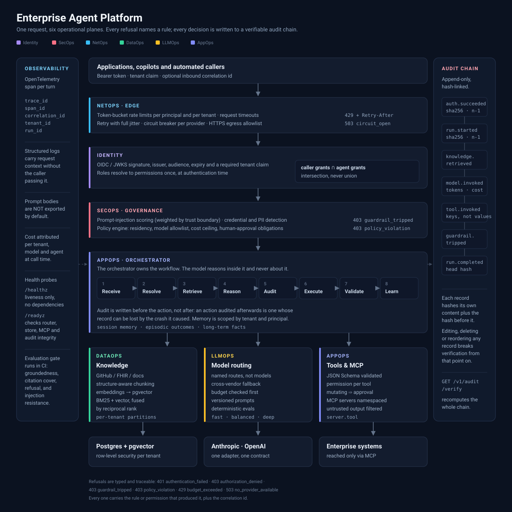

# Enterprise Agent Platform

A provider-neutral control plane for running LLM agents inside an enterprise: identity,
governance, knowledge, model routing and runtime, behind one HTTP surface.

The goal is not a clever chatbot. It is an agent system that an engineering team can
deploy, operate, secure, test and extend — where every refusal names the rule that caused
it, every model call is attributed to a tenant, and every decision lands in an audit log
you can verify.

[](https://github.com/kogunlowo123/enterprise-agent-platform/actions/workflows/ci.yml)
[](https://github.com/kogunlowo123/enterprise-agent-platform/actions/workflows/security.yml)


---

## Architecture



The platform is organised as six planes. Each owns one question, and nothing below the
composition root reaches for a global — every dependency is injected, which is why the
whole tree is testable by substitution rather than by patching.

| Plane | Question it answers | Key decisions |
|---|---|---|
| **Identity** | Who is acting? | Caller authority ∩ agent grant — an intersection, so an agent can never widen its caller's reach |
| **SecOps** | Should this happen at all? | Injection scoring weighted by trust boundary; deny-overrides policy; hash-chained audit |
| **NetOps** | Can we reach it, and should we? | Token-bucket limits, full-jitter retry, circuit breaking, HTTPS egress allowlist |
| **DataOps** | What does the organisation know? | Structure-aware chunking, hybrid BM25 + vector retrieval fused by rank, per-tenant partitions |
| **LLMOps** | Which model, at what cost? | Named routes with cross-vendor fallback, pre-call budget checks, versioned prompts, deterministic evals |
| **AppOps** | How does the turn actually run? | The lifecycle loop, tool dispatch under the full permission chain, MCP gateway, scoped memory |

### The lifecycle

```
Receive → Resolve → Retrieve → Reason → Audit → Execute → Validate → Learn
```

The sequence is the security design as much as the control flow. Guardrails run before
anything else touches the input. Everything that can refuse cheaply refuses before a token
is spent. The audit record is written *before* the action, because an action audited
afterwards is one whose record can be lost by the crash it caused.

The orchestrator owns the workflow. The model reasons inside it and never about it: it
cannot skip validation, widen its own permissions, or decide this turn does not need
auditing.

---

## What is actually built

Everything below is implemented and covered by tests that run in CI. Nothing here is a
stub.

**Identity** — OIDC/JWKS verification with key rotation handling, issuer/audience/expiry
checks, a required tenant claim, role inheritance with cycle tolerance, wildcard permission
matching, and the caller ∩ agent intersection.

**SecOps** — a tamper-evident audit chain (SHA-256 over canonical content, linked to its
predecessor) that detects edits, deletions and reordering and resumes across restarts. A
prompt-injection detector covering ten pattern families with Unicode-obfuscation defeat and
boundary-aware scoring. Credential and PII detection with Luhn validation and entropy
filtering. A deny-overrides policy engine whose rules are data, not code.

**NetOps** — token-bucket rate limiting layered per principal and per tenant, a three-state
circuit breaker admitting exactly one probe on recovery, full-jitter exponential backoff,
and an egress guard that blocks link-local, loopback and private ranges (so an allowlisted
name that resolves into cloud metadata is still refused).

**DataOps** — markdown- and code-aware chunking that keeps headings with their content,
hybrid retrieval fusing BM25 and vector rankings with Reciprocal Rank Fusion, MMR
diversification, and a **GitHub connector** that ingests an existing enterprise repository
at a pinned commit, with permalink citations, rate-limit awareness and secret quarantine.

**LLMOps** — a model router with cross-vendor fallback, per-provider circuit breaking and
budget enforcement before dispatch; per-tenant cost attribution split by model and agent; a
versioned, content-hashed prompt registry with rollback; and a deterministic evaluation
harness that gates CI on groundedness, citation coverage, refusal correctness and injection
resistance.

**AppOps** — JSON-Schema-validated tool dispatch that refuses invented arguments, an MCP
gateway that namespaces tools, infers mutation conservatively, maps permissions and filters
untrusted server output, and memory scoped by tenant *and* principal.

### Two findings the test suite caught

Worth stating plainly, because they are the kind of bug that ships:

1. **The lexical index leaked across tenants.** The vector store was correctly partitioned,
   so the leak only appeared in hybrid mode — BM25 returned another tenant's document and
   fusion placed it in the model's context. Now partitioned per tenant, with a second
   filter in the retriever ([`test_dataops.py::TestLexicalIsolation`](tests/test_dataops.py)).

2. **`fnmatch` does not understand `**`.** The GitHub connector's default include glob
   `**/*` silently excluded every file at repository root, so ingestion reported success
   while quietly skipping the README. Replaced with a real path-glob matcher.

---

## Repository structure

```
enterprise-agent-platform/
├── src/eap/
│   ├── platform/                 # cross-cutting primitives
│   │   ├── config.py             #   settings; refuses unsafe production combinations
│   │   ├── context.py            #   ambient correlation id and principal
│   │   ├── clock.py              #   injectable time, so tests never sleep
│   │   ├── errors.py             #   error taxonomy → RFC 9457 problem documents
│   │   └── telemetry.py          #   structlog + OpenTelemetry wiring
│   │
│   ├── identity/                 # IDENTITY — who is acting
│   │   ├── models.py             #   Principal, Tenant, AgentIdentity, SecurityContext
│   │   ├── rbac.py               #   role resolution and the single authorization point
│   │   └── tokens.py             #   JWKS verification, claims → principal
│   │
│   ├── secops/                   # SECOPS — should this happen
│   │   ├── audit.py              #   hash-chained, append-only, verifiable
│   │   ├── policy.py             #   deny-overrides governance rules with obligations
│   │   └── guardrails/
│   │       ├── injection.py      #   OWASP LLM01 pattern families, boundary-weighted
│   │       ├── pii.py            #   credentials and personal data, Luhn + entropy
│   │       └── pipeline.py       #   composition and the block/allow decision
│   │
│   ├── netops/                   # NETOPS — reachability and blast radius
│   │   ├── ratelimit.py          #   token bucket, layered principal + tenant
│   │   ├── resilience.py         #   retry, circuit breaker, timeouts
│   │   └── egress.py             #   HTTPS allowlist + SSRF range blocking
│   │
│   ├── dataops/                  # DATAOPS — what the organisation knows
│   │   ├── chunking.py           #   structure-aware, citation-carrying
│   │   ├── embeddings.py         #   Embedder protocol; deterministic and OpenAI
│   │   ├── vectorstore.py        #   in-memory and pgvector, partitioned by tenant
│   │   ├── retrieval.py          #   BM25 + vector, RRF fusion, MMR diversity
│   │   ├── ingest.py             #   fetch → guardrail → chunk → embed → store
│   │   └── connectors/
│   │       └── github.py         #   enterprise repository ingestion at a pinned commit
│   │
│   ├── llmops/                   # LLMOPS — which model, at what cost
│   │   ├── router.py             #   named routes, cross-vendor fallback, budget gate
│   │   ├── cost.py               #   token accounting and per-tenant attribution
│   │   ├── prompts.py            #   versioned, content-hashed, rollback-able
│   │   ├── providers/            #   anthropic · openai · deterministic (CI)
│   │   └── evaluation/           #   metrics and the CI gate harness
│   │
│   ├── appops/                   # APPOPS — how the turn runs
│   │   ├── orchestrator.py       #   the eight-stage lifecycle
│   │   ├── memory.py             #   session · episodic · long-term, scoped
│   │   ├── tools/                #   contract, registry, guarded dispatch
│   │   └── mcp/                  #   JSON-RPC client and the containing gateway
│   │
│   ├── api/                      # HTTP surface
│   │   ├── app.py                #   error translation, correlation, lifespan
│   │   ├── dependencies.py       #   the authentication chain, once
│   │   └── routes/               #   agent · knowledge · operations
│   │
│   ├── bootstrap.py              # composition root — every dependency built here
│   └── cli.py                    # ingest, search, verify-audit, routes, dev-token
│
├── tests/                        # 328 tests, no mocked internals
│   ├── conftest.py               #   manual clock, deterministic provider, real stores
│   ├── test_identity.py          #   intersection, isolation, token verification
│   ├── test_secops.py            #   chain tampering, injection, PII, policy
│   ├── test_netops.py            #   bucket arithmetic, breaker states, SSRF
│   ├── test_dataops.py           #   chunking, fusion, tenant isolation
│   ├── test_github_connector.py  #   against real GitHub response shapes
│   ├── test_llmops.py            #   fallback, budgets, prompts, eval gate
│   ├── test_appops.py            #   argument validation, guarded dispatch, memory
│   ├── test_mcp.py               #   against a real MCP server subprocess
│   ├── test_orchestrator.py      #   security invariants, end to end
│   ├── test_api_e2e.py           #   through the assembled HTTP application
│   ├── test_config.py            #   production guards
│   └── fixtures/
│       └── mcp_test_server.py    #   a real stdio MCP server, deliberately hostile
│
├── docs/
│   ├── architecture/             #   the diagram above, and ADRs
│   ├── ARCHITECTURE.md
│   ├── SECURITY.md
│   ├── THREAT-MODEL.md
│   └── EVALUATION.md
│
├── deploy/
│   ├── docker/                   #   multi-stage, non-root, distroless-style runtime
│   ├── helm/                     #   chart with probes, NetworkPolicy, resource limits
│   └── terraform/                #   the module boundary and its variables
│
├── .github/workflows/            #   ci.yml · security.yml
├── Makefile
├── pyproject.toml
└── .env.example
```

---

## Tech stack

| Layer | Choice | Why this one |
|---|---|---|
| Language | **Python 3.11+** | Typed throughout; `mypy --strict` passes with zero ignores in `src/` |
| API | **FastAPI** + Pydantic v2 | Request validation at the edge; OpenAPI for free; problem documents on failure |
| Server | **Uvicorn** | ASGI, so the whole request path is async |
| Identity | **PyJWT** + JWKS | Asymmetric verification against the IdP's published keys |
| Knowledge | **PostgreSQL + pgvector** | Vectors next to relational data; HNSW cosine index; row-level security per tenant |
| Retrieval | BM25 (own implementation) + vector | Hybrid, fused by Reciprocal Rank Fusion — ranks compare, scores do not |
| Models | **Anthropic**, **OpenAI** | One adapter each behind a single contract; the platform is provider-neutral by construction |
| Tools | **Model Context Protocol** | JSON-RPC 2.0 over stdio; servers namespaced and contained |
| Observability | **OpenTelemetry** + **structlog** | Structured events, trace correlation, prompt bodies excluded by default |
| Testing | **pytest** + `pytest-asyncio` | 328 tests; real subprocesses and real HTTP, not mocked internals |
| Quality | **ruff**, **mypy --strict** | Lint, format and types enforced in CI |
| Supply chain | **pip-audit**, **Trivy**, **Bandit**, **CycloneDX SBOM** | Dependency, container, static and inventory scanning |
| Packaging | **Docker** (multi-stage, non-root) | Reproducible image, no build toolchain in the runtime layer |
| Deployment | **Helm**, **Terraform** | Probes, limits and NetworkPolicy declared with the workload |

---

## Quick start

```bash
git clone https://github.com/kogunlowo123/enterprise-agent-platform.git
cd enterprise-agent-platform

python -m venv .venv && source .venv/bin/activate    # Windows: .venv\Scripts\activate
pip install -e ".[dev]"

make test        # 328 tests, no credentials or network required
make check       # lint, format check, types, tests
```

With no model credentials configured the platform serves a **deterministic provider**: a
real implementation of the provider contract that answers from the supplied context and
cites its sources. It is not a mock — routing, budgeting, guardrails, orchestration and
evaluation all execute exactly as they do against a vendor, with no network and no cost.
`Settings` refuses to start with it in staging or production.

### Run it

```bash
cp .env.example .env
export EAP_IDENTITY_DEV_SIGNING_KEY="a-local-development-key-at-least-32-bytes"

make run                                    # http://localhost:8000/docs
TOKEN=$(eap dev-token --tenant acme)        # mints an HS256 token; local only
```

Ingest an existing repository and ask a question about it:

```bash
export EAP_DATAOPS_GITHUB_TOKEN=...         # optional; only for private repositories

eap ingest-github kogunlowo123/enterprise-agent-platform --tenant acme --include 'docs/**' --include '*.md'

curl -s localhost:8000/v1/agent/ask \
  -H "Authorization: Bearer $TOKEN" -H 'content-type: application/json' \
  -d '{"question":"How does the platform isolate one tenant from another?"}' | jq
```

The response carries the answer, its citations pinned to a commit SHA, the model and route
that served it, the cost, retrieval diagnostics, and the audit chain head:

```json
{
  "run_id": "run_7h2kq9x4m1n8p3vw",
  "answer": "Each read and write takes a tenant_id, and the store partitions by it rather than filtering after the fact [2].",
  "citations": ["vectorstore.py — https://github.com/.../blob/4f2a1c9/src/eap/dataops/vectorstore.py"],
  "model": "claude-sonnet-5",
  "route": "balanced",
  "fell_back": false,
  "cost_usd": 0.004182,
  "retrieval": { "strategy": "hybrid_rrf+mmr", "documents": 6, "groundedness": 0.71 },
  "warnings": [],
  "audit_head": "9c1f...e4a7"
}
```

Then confirm nothing has been tampered with:

```bash
curl -s localhost:8000/v1/audit/verify -H "Authorization: Bearer $TOKEN" | jq
```

---

## API

| Method | Path | Permission | Purpose |
|---|---|---|---|
| `POST` | `/v1/agent/ask` | `agent:invoke` | Run one agent turn end to end |
| `POST` | `/v1/knowledge/github` | `knowledge:write` | Ingest a repository at a pinned commit |
| `GET` | `/v1/knowledge/search` | `knowledge:read` | Retrieval without generation — for debugging a bad answer |
| `GET` | `/v1/audit/verify` | `audit:read` | Recompute and verify the hash chain |
| `GET` | `/v1/cost/attribution` | `tenant:admin` | Today's spend by model and agent |
| `GET` | `/v1/policy/rules` | `audit:read` | The governance rules in force |
| `GET` | `/healthz` | — | Liveness; consults no dependency, deliberately |
| `GET` | `/readyz` | — | Readiness; checks router, store, MCP and audit integrity |

Failures are RFC 9457 problem documents carrying a stable `code`, the rule or permission
that produced the refusal, and the correlation id.

---

## Security posture

Full detail in [`docs/SECURITY.md`](docs/SECURITY.md) and
[`docs/THREAT-MODEL.md`](docs/THREAT-MODEL.md). The short version:

- **Least privilege by construction.** Effective authority is the intersection of the
  caller's grants and the agent's own. An agent's `forbidden_tools` are enforced even when
  the caller holds the permission.
- **Indirect injection is handled at ingestion, not retrieval.** A poisoned document never
  enters the store, so the check does not have to run on every query forever.
- **Untrusted MCP output is contained.** Tool responses from servers the platform does not
  control pass through the guardrail pipeline before reaching the model.
- **Mutating tools require a human.** Policy attaches an approval obligation; the
  dispatcher raises rather than returning a flag that a caller could forget to check.
- **Agents cannot escalate through delegation.** A principal that is itself an agent is
  refused any mutating tool.
- **Egress is allowlisted**, and an allowlisted name resolving into a private or
  link-local range is still refused.
- **Audit is tamper-evident** and verifiable over HTTP.

Pattern matching catches unsophisticated injection, not a determined attacker who
paraphrases or encodes. It is one layer. The ones carrying real weight are the permission
intersection, least-privilege tool grants, human approval on writes, and egress control —
all of which hold when the detector misses, which it will.

---

## Testing

```bash
make test                       # everything
make test-unit                  # skip the MCP subprocess integration tests
make eval                       # run the evaluation suite as a gate
pytest --cov=src/eap            # coverage report
```

328 tests, 81% line coverage. The uncovered remainder is the vendor HTTP adapters and
pgvector paths, which need real external systems — everything else runs offline.

The suite substitutes rather than mocks. The clock is manual, so rate limiters and circuit
breakers are tested by advancing time rather than sleeping. The MCP tests spawn a real
server subprocess and speak real JSON-RPC over real pipes. The end-to-end tests drive the
assembled application over HTTP.

---

## Deployment

```bash
make docker-build
helm upgrade --install eap deploy/helm/eap --values deploy/helm/eap/values.prod.yaml
```

The image is multi-stage and runs as a non-root user with a read-only root filesystem. The
Helm chart declares liveness and readiness probes against the two distinct endpoints,
resource limits, a `NetworkPolicy` matching the application-layer egress allowlist, and a
`PodDisruptionBudget`.

`Settings` validates the whole configuration at startup and refuses to run in staging or
production with an in-memory audit sink, HS256 development signing, the deterministic
embedder, injection enforcement disabled, or prompt content export enabled. Every problem
is reported at once, so one deploy attempt gives you the full list.

---

## Documentation

| Document | Contents |
|---|---|
| [`docs/ARCHITECTURE.md`](docs/ARCHITECTURE.md) | Plane boundaries, request path, extension points |
| [`docs/SECURITY.md`](docs/SECURITY.md) | Controls, what they cover, and what they do not |
| [`docs/THREAT-MODEL.md`](docs/THREAT-MODEL.md) | Assets, actors, OWASP LLM Top 10 mapping, residual risk |
| [`docs/EVALUATION.md`](docs/EVALUATION.md) | Metrics, why each is deterministic, the CI gate |
| [`docs/architecture/adr/`](docs/architecture/adr/) | Decision records with the alternatives rejected |

## License

Apache-2.0. See [`LICENSE`](LICENSE).
